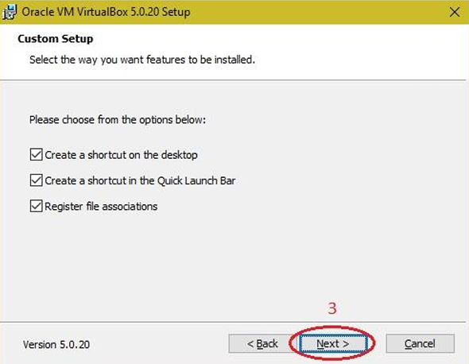

# Experiment 1: Installation of Virtualization Software

## Aim

To install virtualization software and create virtual machines with different flavours of Linux or Windows operating systems.

---

## Introduction

Virtualization is a technology that allows a physical computer, known as the **host machine**, to run one or more virtual computers, known as **virtual machines**, simultaneously.

A virtualization platform provides virtual hardware resources to the virtual machine, including:

* Virtual CPU
* Virtual RAM
* Virtual storage (Virtual Hard Disk)
* Virtual network adapters
* Virtual display and graphics acceleration
* Virtual input devices such as keyboard and mouse

An operating system running inside a virtual machine is called the **guest operating system**, while the physical operating system hosting the virtualization software is called the **host operating system**.

Common desktop virtualization platforms include:

* Oracle VM VirtualBox
* VMware Workstation
* Microsoft Hyper-V

---

## Software Used

* **Host Operating System:** Windows
* **Virtualization Software:** Oracle VM VirtualBox
* **Guest Operating System:** Linux / Windows

---

## Procedure

### Step 1: Download and Start VirtualBox Installer

Download the Oracle VM VirtualBox installer for Windows from the official website. Launch the downloaded setup file. The VirtualBox Setup Wizard appears. Click **Next** to continue.

---

### Step 2: Select Installation Components

The **Custom Setup** window displays the VirtualBox components and features available for installation. Review the selected components and installation directory, then click **Next**.

---

### Step 3: Configure Installation Options

The installation options are displayed. Select the required options such as:

* Create a shortcut on the desktop
* Create a shortcut in the Quick Launch Bar
* Register file associations

Click **Next** to continue.

---

### Step 4: Confirm Network Interface Installation

VirtualBox installs virtual network adapters to enable communication between the host operating system and virtual machines.

The installer displays a warning indicating that network connections may be temporarily reset during the installation. Click **Yes** to proceed.

---

### Step 5: Start the Installation

The **Ready to Install** screen appears. Review the selected installation settings and click **Install** to begin the installation process.

---

### Step 6: Complete the Installation

After the installation process is completed successfully, click **Finish**.

Oracle VM VirtualBox is now installed on the Windows host operating system and is ready for creating and running virtual machines.

---

## Result

The virtualization software, **Oracle VM VirtualBox**, was successfully installed on the Windows host operating system.

---

## Conclusion

The virtualization software was successfully installed and configured. The system is now ready for creating and running virtual machines with different guest operating systems such as Linux or Windows.
