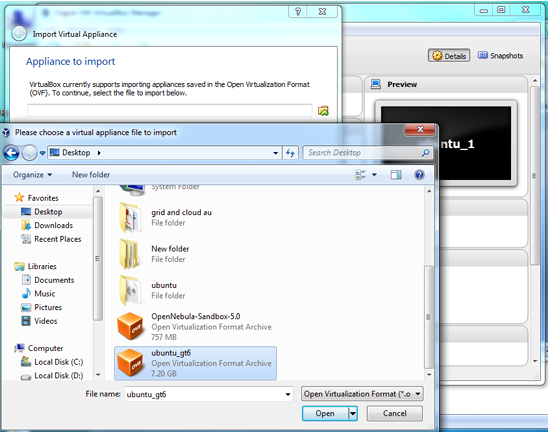

# Experiment 2: Install a C Compiler in a Virtual Machine and Execute a Simple Program

## Aim

To install and use a C compiler in the virtual machine created using VirtualBox and execute simple C programs.

---

## Objectives

* To understand how a Linux virtual machine can be used as a development environment.
* To use a C compiler inside the virtual machine.
* To create a C source file.
* To compile the C source file.
* To execute the generated program.
* To understand the basic workflow of compiling and executing a C program.

---

## Software Used

* **Virtualization Platform:** Oracle VM VirtualBox
* **Guest Operating System:** Ubuntu Virtual Machine
* **Compiler:** GCC (GNU Compiler Collection)
* **Text Editor:** `gedit`

---

## Procedure

# 1. Import the Ubuntu Virtual Machine

### Step 1: Open VirtualBox

Open **Oracle VM VirtualBox** on the host computer.

---

### Step 2: Import the Appliance

From the VirtualBox top menu, select:

**File → Import Appliance**

The **Import Virtual Appliance** window will be displayed.

---

### Step 3: Select the Ubuntu Appliance

Browse to the location of the virtual appliance file `ubuntu_gt6.ova`, select the file, and proceed with the import.



---

### Step 4: Configure USB Settings

Open the settings of the imported virtual machine. Navigate to **USB** settings and select **USB 1.1**.

---

### Step 5: Start the Virtual Machine

Start the imported Ubuntu virtual machine and wait for the Ubuntu operating system to boot successfully.

---

# 2. Compile and Execute a C Program

### Step 1: Open the Terminal

Open a terminal inside the Ubuntu virtual machine.

---

### Step 2: Navigate to the Working Directory

Navigate to the required working directory using the following command:

```bash
cd /opt/axis2/axis2-1.7.3/bin
```

---

### Step 3: Create the C Source File

Open `gedit` to create `hello.c`:

```bash
gedit hello.c
```

Enter the following C program:

```c
#include <stdio.h>

int main()
{
    printf("Hello, World!\n");
    return 0;
}
```

Save the file as `hello.c`.


---

### Step 4: Compile the Program

Compile the source file using GCC:

```bash
gcc hello.c
```

GCC compiles the source file and generates the default executable binary named `a.out`.

---

### Step 5: Execute the Program

Run the generated executable using:

```bash
./a.out
```

The output of the C program is displayed in the terminal.

---

# 3. Create, Compile, and Execute `first.c`

### Step 1: Create `first.c` Using gedit

Open `gedit` to create the C source file:

```bash
gedit first.c
```

---

### Step 2: Write the C Program

Enter the following C program to determine whether a number is even or odd:

```c
#include <stdio.h>

int main()
{
    int a;

    printf("Enter the number to find Even or Odd: ");
    scanf("%d", &a);

    if (a % 2 == 0)
        printf("The entered number is Even\n");
    else
        printf("The entered number is Odd\n");

    return 0;
}
```

Save the file as `first.c` and exit `gedit`.

---

### Step 3: Compile the Program

Compile `first.c` using GCC:

```bash
gcc first.c
```

---

### Step 4: Execute the Program

Run the compiled executable:

```bash
./a.out
```

Enter a number when prompted. The program displays whether the entered number is even or odd.

---

## Important Commands

### Navigate to Directory

```bash
cd /opt/axis2/axis2-1.7.3/bin
```

### Open Text Editor

```bash
gedit hello.c
gedit first.c
```

### Compile C Programs

```bash
gcc hello.c
gcc first.c
```

### Execute Compiled Output

```bash
./a.out
```

---

## Result

The GCC C compiler was successfully used inside the Ubuntu virtual machine to create, compile, and execute C programs.

The `hello.c` program successfully displayed **Hello, World!**, and the `first.c` program successfully determined whether a given number was even or odd.

---

## Conclusion

This experiment demonstrated how a virtual machine can provide an isolated Linux development environment for writing, compiling, and executing C programs.

GCC was used to compile the C source files, and the generated executable programs were successfully executed inside the Ubuntu virtual machine.
