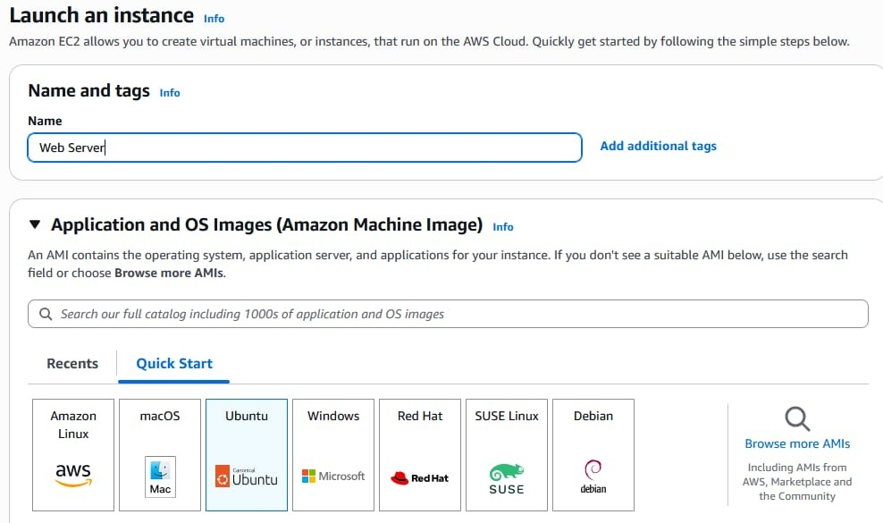
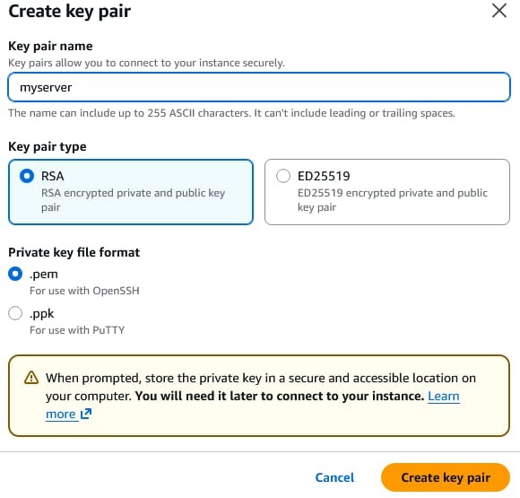
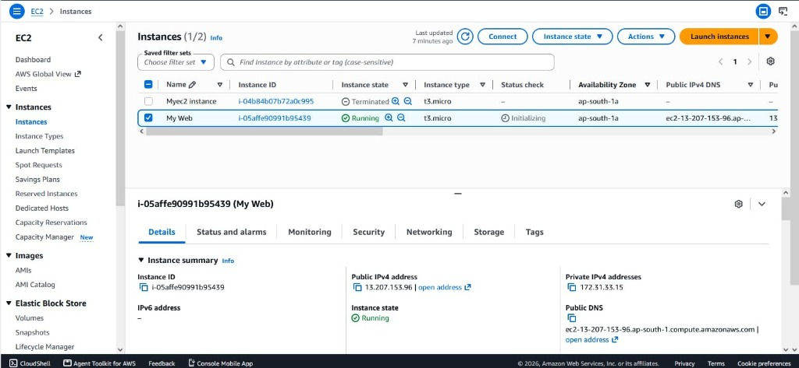
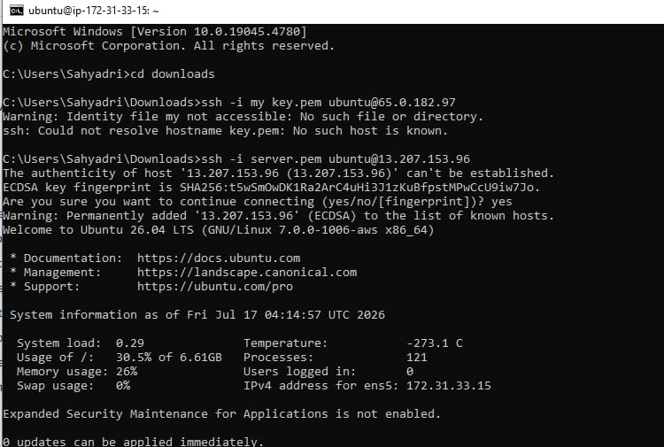

# Experiment 3: Create EC2 Instance in AWS (Amazon)

## Aim

To create an EC2 instance in AWS (Amazon) and connect to it using an SSH key.

---

## Introduction

Amazon Elastic Compute Cloud (Amazon EC2) provides virtual computing resources in the AWS Cloud. An EC2 instance can be created by selecting an operating system image, instance type, storage, and networking configuration.

This experiment demonstrates the procedure for creating an EC2 instance and connecting to the instance using an SSH key pair.

---

## Software / Services Used

* **Amazon Web Services (AWS)**
* **Amazon EC2**
* **AWS Management Console**
* **SSH Client / Terminal**
* **EC2 Key Pair (`.pem`)**

---

## Procedure

### Step 1: Log in to AWS and Open EC2

1. Log in to your AWS account.
2. Open the **Services** menu from the AWS Management Console.
3. Select **EC2** from the available services.
4. From the EC2 dashboard, the running instances can be viewed under the resources section.

The EC2 dashboard is used to create and manage virtual servers in AWS.

---

### Step 2: Launch an Instance

1. From the EC2 console dashboard, click **Launch instance**.
2. The **Launch an instance** page is displayed.
3. Under **Name and tags**, enter a suitable name for the instance, such as `Web Server`.



---

### Step 3: Select an AMI (Amazon Machine Image)

Select the required AMI according to the operating system required for the experiment, such as **Ubuntu** or **Amazon Linux**.

An AMI acts as a template containing the operating system and initial software configuration used to launch an EC2 instance.

---

### Step 4: Select Instance Type and Create a Key Pair

1. Under **Instance type**, select an appropriate instance type such as `t2.micro` or `t3.micro`.
2. The instance type determines the computing resources allocated to the EC2 instance, including CPU and memory.
3. Under **Key pair (login)**, click **Create key pair**.
4. In the **Create key pair** dialog:

   * Enter a suitable key pair name, such as `myserver` or `server`.
   * Select **RSA** as the key pair type.
   * Select **.pem** as the private key file format.
5. Click **Create key pair**.
6. The `.pem` private key file is downloaded to the local computer.



---

### Step 5: Configure Network and Storage

Configure the network and storage settings for the EC2 instance.

#### Network Settings

* Keep the default VPC and subnet settings where appropriate.
* Ensure that **Auto-assign Public IP** is enabled.
* Allow SSH access through **Port 22** in the security group.

#### Storage

Configure the required storage for the instance, such as an EBS root volume using `gp2` or `gp3`.

---

### Step 6: Launch the Instance

Before launching the instance, verify the following settings:

* Selected operating system / AMI
* Instance type
* Key pair
* Network configuration
* Storage configuration

Click **Launch instance**.

The EC2 instance is created successfully.

---

### Step 7: Select Instance and Click Connect

From the EC2 **Instances** page:

1. Select the newly created EC2 instance.
2. Verify that the instance state is **Running**.
3. Click the **Connect** button at the top of the page.



---

### Step 8: Connect to the Instance from Terminal

1. Open a terminal or Command Prompt on the local computer.
2. Navigate to the directory where the downloaded `.pem` private key is stored.

```bash
cd Downloads
```

3. Use the SSH command to connect to the EC2 instance:

```bash
ssh -i "server.pem" ubuntu@<Public-IP-Address>
```

Replace `<Public-IP-Address>` with the public IP address of your EC2 instance.

4. If prompted to confirm the host key fingerprint, type:

```text
yes
```

5. The SSH connection is established and the remote terminal prompt appears.



---

## Important Security Rules

* Protect the private key file (`.pem`).
* **Never upload private keys to GitHub.**
* Add `*.pem` and `*.ppk` to `.gitignore` when working with EC2 keys.
* Do not share your private key with others.
* Terminate the EC2 instance when testing is complete to avoid unexpected AWS charges.

---

## Result

An EC2 instance was successfully created in Amazon Web Services by selecting an operating system image, instance type, key pair, network configuration, and storage.

The EC2 instance was successfully accessed remotely using an SSH key.

---

## Conclusion

This experiment demonstrated how an EC2 instance can be provisioned in AWS and accessed remotely using an SSH key. The experiment provided practical understanding of cloud-based virtual machines, AMIs, instance types, key pairs, networking, storage, and SSH-based remote access.
