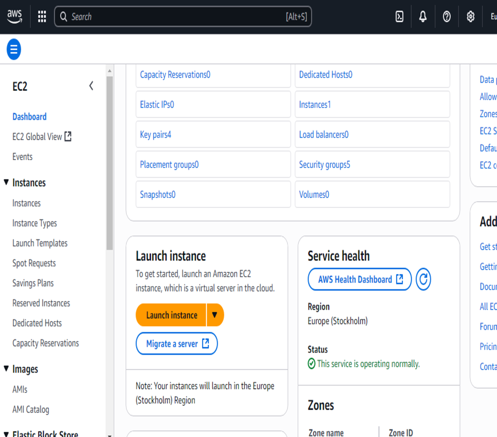
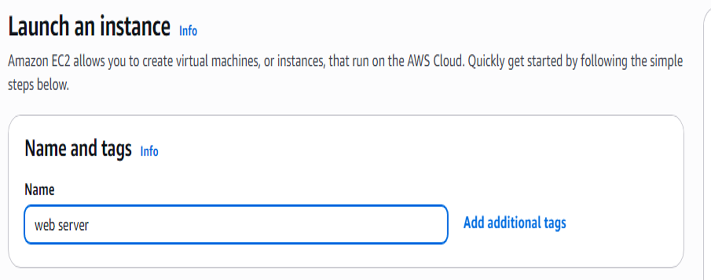
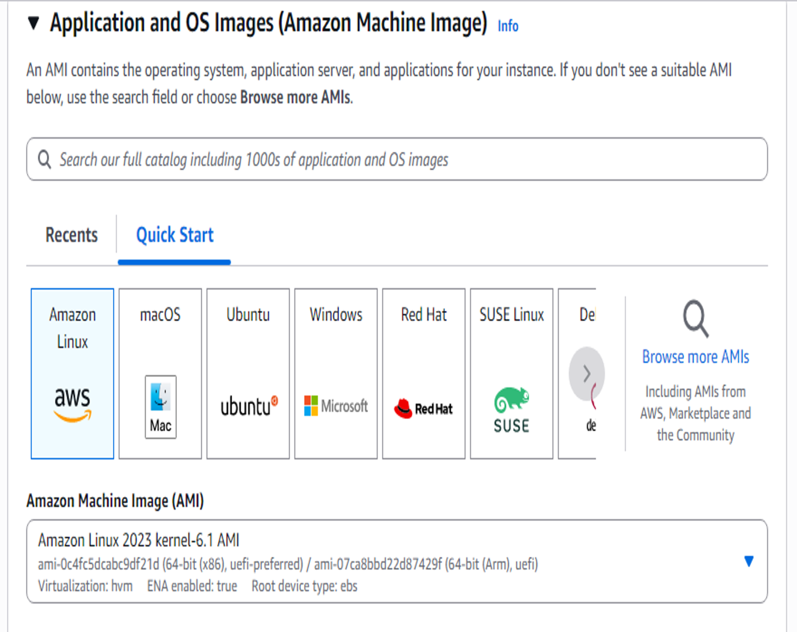
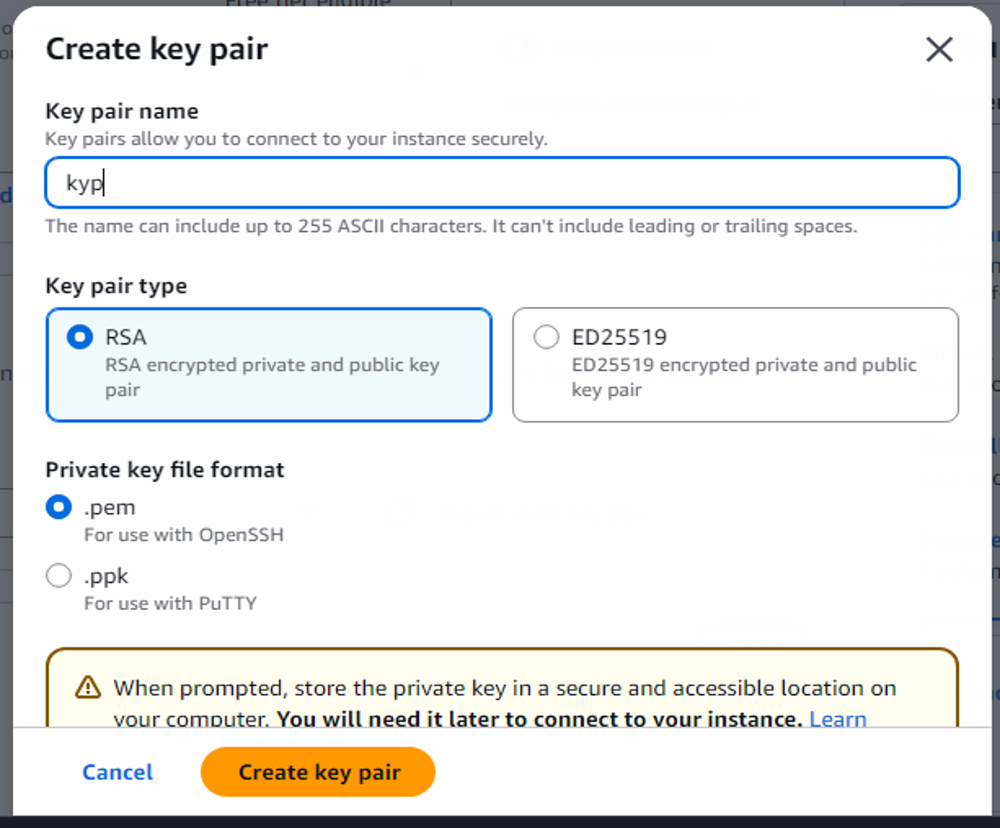
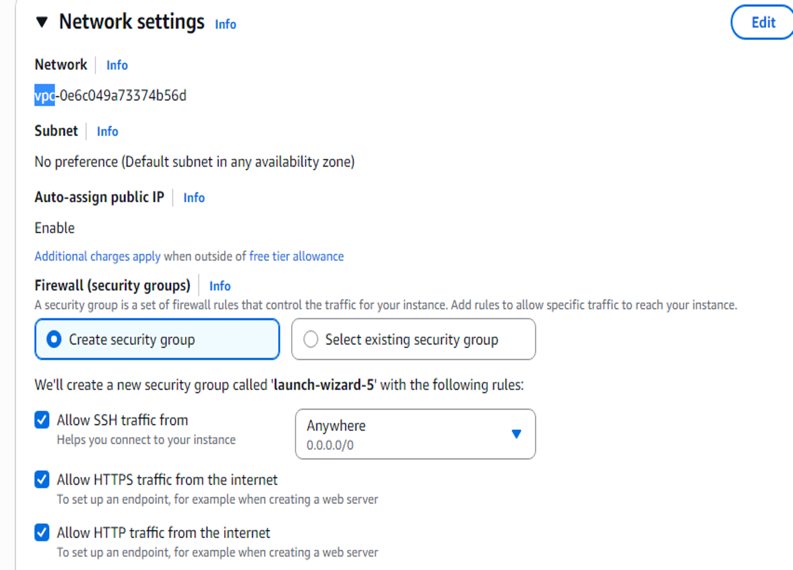
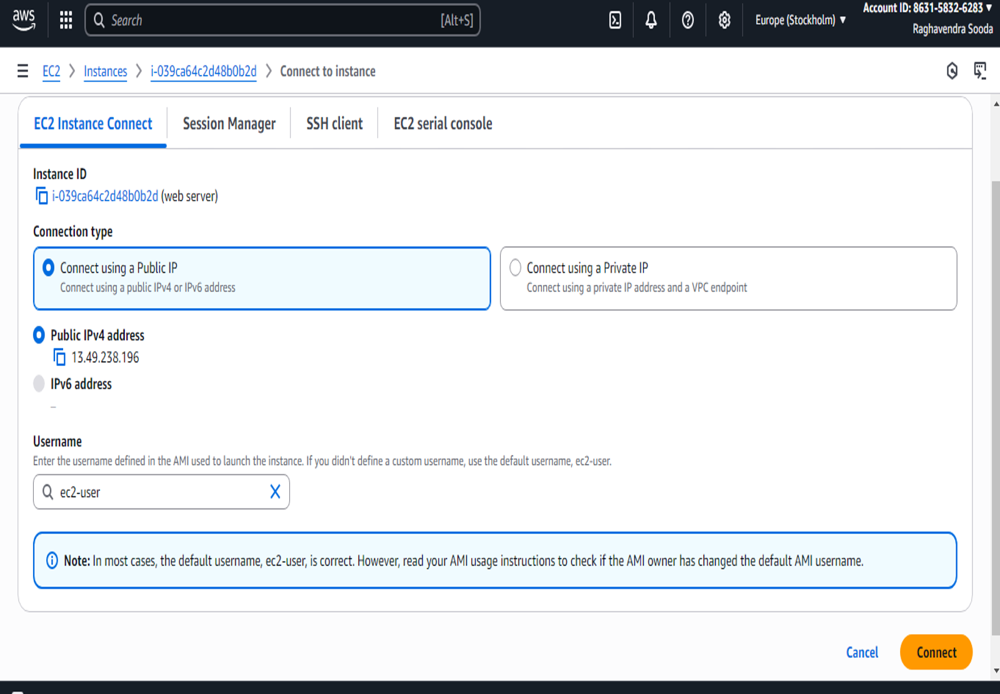
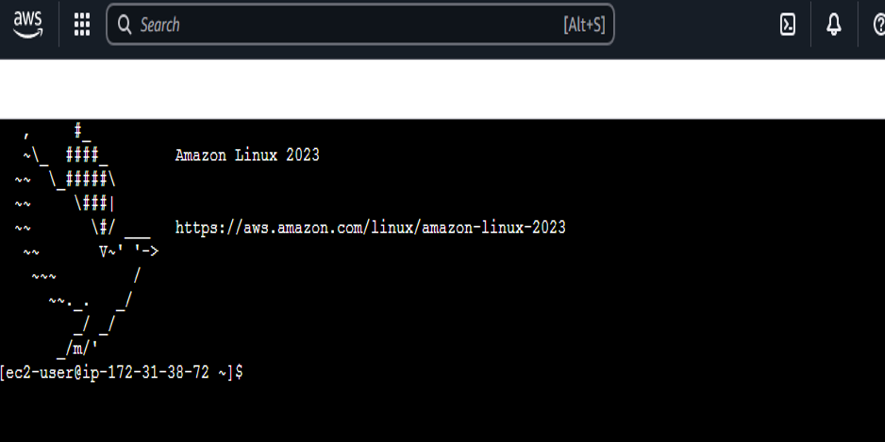

# Experiment 8: Deploy Dynamic Web Application on EC2 Instance on AWS

## Aim

To deploy a dynamic web application on an EC2 Instance on AWS.

---

## Objectives

- To launch an Amazon EC2 virtual server running Amazon Linux.
- To configure security group rules allowing HTTP, HTTPS, and SSH traffic.
- To connect to the instance using EC2 Instance Connect.
- To install and configure the Apache Web Server (`httpd`).
- To download, extract, and deploy a web application template (`templatemo_596_electric_xtra`) to `/var/www/html/`.
- To access the deployed web application live from a web browser using the instance's public IP address.

---

## Software / Services Used

- **Cloud Platform:** Amazon Web Services (AWS)
- **Compute Service:** Amazon EC2
- **Operating System (AMI):** Amazon Linux 2023
- **Instance Type:** `t3.micro`
- **Web Server:** Apache HTTP Server (`httpd`)
- **Connection Method:** EC2 Instance Connect
- **Utilities:** `yum`, `wget`, `unzip`, `systemctl`

---

# Procedure

## Step 1: Launch an EC2 Instance

1. Log in to the AWS Management Console.
2. Search for **EC2** using the search bar.
3. Select **EC2** and open the EC2 Dashboard.
4. Click the **Launch instance** button.



---

## Step 2: Enter Instance Name

Under **Name and tags**, enter a suitable name for the instance.

For example:

```text
web server
```

The name helps identify the EC2 instance in the AWS console.



---

## Step 3: Select Application and OS Image

Under **Application and OS Images (Amazon Machine Image)**, select **Amazon Linux** from the Quick Start options.

For this experiment, Amazon Linux 2023 can be selected.

The AMI provides the operating system and initial software configuration required to launch the EC2 instance.



---

## Step 4: Create a Key Pair

1. Under **Key pair (login)**, click **Create new key pair**.
2. Enter the key pair name:

```text
kyp
```

3. Select **RSA** as the key pair type.
4. Select **.pem** as the private key file format.
5. Click **Create key pair**.

The private key file `kyp.pem` is downloaded to the local computer.

> **Important:** Never upload the `.pem` private key file to GitHub.



---

## Step 5: Configure Network Settings

Configure the network settings for the EC2 instance.

Enable the following options:

- **Allow SSH traffic from**
- **Allow HTTPS traffic from the internet**
- **Allow HTTP traffic from the internet**

HTTP is required so that the deployed web application can be accessed through a web browser.

HTTPS can be enabled for secure web traffic.

SSH is required for remote administration of the instance.

Leave the storage and advanced settings at their default values.

Finally, click **Launch Instance**.



---

## Step 6: Select the Running Instance and Connect

1. After launching, open the **Instances** section.
2. Locate the newly created instance named `web server`.
3. Verify that the instance state is **Running**.
4. Select the instance.
5. Click the **Connect** button.


---

## Step 7: Connect Using EC2 Instance Connect

1. On the **Connect to instance** page, select the **EC2 Instance Connect** tab.
2. Select **Connect using a Public IP**.
3. Verify the public IPv4 address.
4. Verify that the username is:

```text
ec2-user
```

5. Click **Connect**.

A browser-based terminal session will open after the connection is established.



---

## Step 8: Install Apache and Deploy the Web Application

After connecting to the EC2 instance through the terminal, execute the following commands.

### 8.1 Switch to Root User

```bash
sudo su -
```

### 8.2 Update System Packages

```bash
yum update -y
```

### 8.3 Install Apache Web Server

```bash
yum install -y httpd
```

Apache HTTP Server is installed using the `httpd` package.

### 8.4 Create a Temporary Directory

```bash
mkdir temp
cd temp
```

### 8.5 Download the Website Template

Download the `templatemo_596_electric_xtra` template from Templatemo.

```bash
wget <Templatemo-Electric-Xtra-download-URL>
```

Check the downloaded file:

```bash
ls -lrt
```

### 8.6 Extract the Template

Create a directory for the extracted files:

```bash
mkdir templatemo_596_electric_xtra_unzipped
```

Extract the downloaded archive:

```bash
unzip templatemo_596_electric_xtra -d templatemo_596_electric_xtra_unzipped
```

Navigate to the extracted directory:

```bash
cd templatemo_596_electric_xtra_unzipped
ls -lrt
```

### 8.7 Copy the Website Files to Apache Document Root

Navigate to the template directory:

```bash
cd templatemo_596_electric_xtra
```

Check the files:

```bash
ls -lrt
```

Move the website files to the Apache document root:

```bash
mv * /var/www/html/
```

Navigate to the Apache document root:

```bash
cd /var/www/html/
```

Verify the deployed files:

```bash
ls -lrt
```

### 8.8 Start Apache Web Server

Check the Apache service:

```bash
systemctl status httpd
```

Enable Apache to start automatically:

```bash
systemctl enable httpd
```

Start the Apache web server:

```bash
systemctl start httpd
```

The web server is now running on the EC2 instance.



---

## Step 9: Access the Deployed Web Application

1. Return to the AWS EC2 **Instances** page.
2. Select the `web server` instance.
3. Copy the **Public IPv4 address** of the instance.
4. Open a web browser.
5. Enter the following address:

```text
http://<EC2-Public-IP>
```

For example:

```text
http://13.49.238.196
```

6. Press **Enter**.

The deployed **Electric Xtra - Beyond Limits** web application should be displayed in the browser.


---

# Important Commands

### Switch to Root User

```bash
sudo su -
```

### Update Packages

```bash
yum update -y
```

### Install Apache

```bash
yum install -y httpd
```

### Create Directory

```bash
mkdir temp
cd temp
```

### Download Website

```bash
wget <Templatemo-Electric-Xtra-download-URL>
```

### Extract Website

```bash
unzip templatemo_596_electric_xtra -d templatemo_596_electric_xtra_unzipped
```

### Move Website Files

```bash
mv * /var/www/html/
```

### Check Apache Status

```bash
systemctl status httpd
```

### Enable Apache

```bash
systemctl enable httpd
```

### Start Apache

```bash
systemctl start httpd
```

---

# Result

An Amazon Linux EC2 instance named `web server` was successfully launched on AWS.

The required security group rules for SSH, HTTP, and HTTPS traffic were configured. The instance was accessed using EC2 Instance Connect, and the Apache HTTP Server (`httpd`) was installed and configured.

The `templatemo_596_electric_xtra` web application template was downloaded, extracted, and deployed to the Apache document root:

```text
/var/www/html/
```

The deployed web application was successfully accessed through the EC2 instance's public IPv4 address using a web browser.

---

# Conclusion

This experiment demonstrated the deployment of a dynamic web application on an Amazon EC2 instance.

The experiment provided practical knowledge of launching an EC2 instance, configuring security groups, connecting to a cloud server using EC2 Instance Connect, installing an Apache web server, deploying website files, and accessing the application through the public internet.

The successful deployment shows how AWS EC2 can be used to host and serve web applications using cloud-based virtual infrastructure.